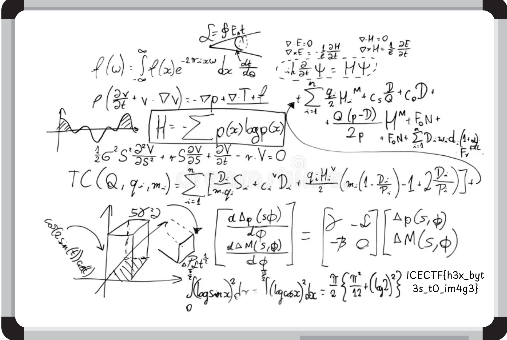

# Inception

"Downward Is The Only Way Forward." -Dom Cobb-

You’re entering a world of layers within layers, like a dream within a dream. Somewhere deep inside this archive lies the final truth but only if you can make it to the core.

Author: @arifpeycal

[dream.zip](dream.zip)


## Pandangan pertama

Benda pertama yang aku perasan, kata kunci "Inception", "layers within layers", dan ada lampiran _(attachment)_ ZIP file. Tak lain tak bukan, ini mesti ZIP dalam ZIP!

### Fail ZIP

Untuk pastikan, aku pun gunalah pengarkib fail _(file archiver)_ untuk tengok kandungan `dream.zip`. Struktur direktorinya macam ini:

```
dream.zip
 └ dream/
    └ dream_0.zip
       ├ dream_0.txt
       └ dream_1.zip
          ├ dream_1.txt
          └ dream_2.zip
             ├ dream_2.txt
             └ dream_3.zip
                ├ dream_3.txt
                └ dream_4.zip
                   ┊
```

_Mak aih_, dalamnya! Kalau nak ekstrak satu-satu, boleh makan masa makan tenaga!

### Teks memimpi (mimpi-mimpi?)

Kemudian, aku periksa isi kandungan `dream_0.txt`, `dream_1.txt`.

> `dream_0.txt`, 5.0KiB
```txt
89504e470d0a1a0a0000000d494844520000063c0000042e0806000000681894b2000000017352474200aece1ce90...
```

> `dream_1.txt`, 5.0KiB
```txt
6e96fc1e1e2f7af18bbb6dee7defe1590821841042082184104208218410d624af7fe31b86478b9b25bf87c70b8e38627814420821841042082184104...
```

Disebabkan aku banyak tengok _channel_ YouTube [LiveOverflow](https://www.youtube.com/LiveOverflow) (tapi tak pernah sertai CTF dengan bersungguh-sungguh), aku dapat kesan beberapa ciri dari fail ini:

1. Isi kandungan ini ialah perenambelasan _(hexadecimal)_. Semua huruf dia hanya di antara 0-9A-F. Berbeza dengan Base64 kerana Base64 menggunakan lebih banyak huruf.
2. Fail ini, bila dinyahkod _(decode)_, bukanlah fail ASCII. Nilai-nilai dalam fail ini lebih dari 0x7f. ASCII ialah kod 7-bit, makanya nilai dia mestilah antara 0x00-0x7f.
3. Semua fail mempunyai saiz yang sama. Boleh jadi kita perlu gabungkan semua.

Buat masa sekarang, itu sahaja maklumat yang boleh diperoleh, jadi kita cuba nyahkod!


## Pecahkan kod

### Ekstrak ZIP

Oh iya, aku pengguna Arch Linux! Jadi aku boleh gunakan Bash untuk ekstrak semua fail ZIP itu.

1. Dapatkan semua nama fail ZIP.
```sh
find . -name '*.zip'
```

2. Ekstrak dan hapuskan fail tersebut.
```sh
unzip $i
rm $i
```

3. Ulang sampai Abang Jamil mamp--.

Sewaktu CTF, aku terus taip dalam jurubahasa(?) _(interpreter)_, tapi hasil akhirnya serupa begini. [extrac.sh](extrac.sh)

### Gabungkan kod perenambelasan dan nyahkod

Untuk memudahkan lagi cara, lebih mudah untuk buat skrip Python untuk gabung semua fail.

1. Buka semua fail `dream_*.txt`, simpan dalam _list_
```python
data = []
for i in range(0, 235+1):  # dream_0.txt - dream_235.txt
    with open(f'dream_{i}.txt', 'r') as f:
        data.append(f.read())
```

2. Tukarkan semua huruf perenambelasan kepada bait _(bytes)_
```python
byts = []
for x in data:
    byts.append(bytes.fromhex(x))
```

3. Catatkan _(write)_ semua kepada fail binari baru
```python
with open('dream.png', 'wb') as f:
    for x in byts:
        f.write(x)
```


## Penyelesaian

Di penghujung cerita, output ialah imej `dream.png`. Bendera terdapat dalam imej tersebut.



**Bendera: `ICECTF{h3x_byt3s_t0_im4g3}`**