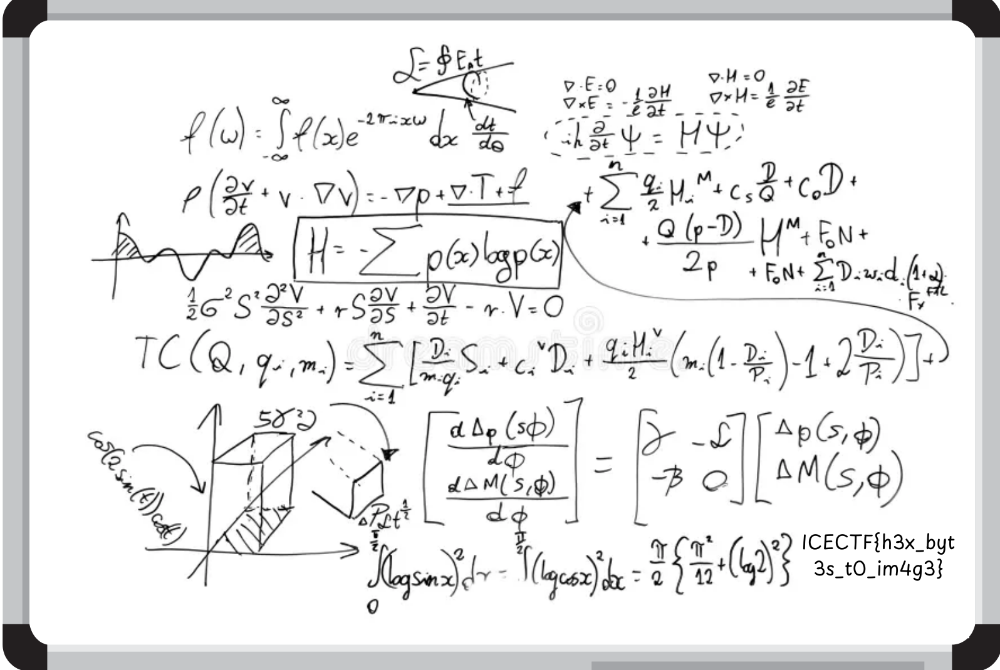

# Inception

"Downward Is The Only Way Forward." -Dom Cobb-

You’re entering a world of layers within layers, like a dream within a dream. Somewhere deep inside this archive lies the final truth but only if you can make it to the core.

Author: @arifpeycal

[dream.zip](dream.zip)


## Langkah 1: Ekstrak ZIP dalam ZIP

Menggunakan Bash, kita boleh ulang kali ekstrak fail ZIP sehingga habis.

```sh
while true; do
    for i in $(find . -name '*.zip'); do    # cari ZIP di mana-mana
        unzip $i
        rm $i
    done
done
# kekurangan kod ini, ia tak akan tamat. guna CTRL+C
```


## Langkah 2: Gabungkan kod _hex_

Fail ZIP tadi mempunyai fail TXT, contohnya `dream_0.txt`, `dream_1.txt` yang berisi kod _hex_.

> `dream_0.txt`, 5.0KiB
```txt
89504e470d0a1a0a0000000d494844520000063c0000042e0806000000681894b2000000017352474200aece1ce90...
```

Menggunakan Python, kita kumpulkan kesemua kod tersebut.

```python
data = []
for i in range(0, 235+1):   # dream_0.txt - dream_235.txt
    with open(f'dream_{i}.txt', 'r') as f:
        data.append(f.read())
```


## Langkah 3: Nyahkod dan simpan sebagai fail binari

Setelah kesemua kod _hex_ dikumpulkan dalam _list_ `data`, kita tukarkan kepada binari menggunakan `bytes.fromhex()`. Sambil itu kita tulis terus ke dalam fail.

Tambahan lagi, kita boleh tahu ini fail apa, dengan mengenalpasti [_header_](https://en.wikipedia.org/wiki/List_of_file_signatures) fail ini iaitu `89504e47...`, merujuk kepada _header_ PNG.

```python
f = open('dream.png', 'wb') # buka untuk catatan dalam mod binari
for x in data:
    out = bytes.fromhex(x)
    f.write(out)
```

## Langkah 4: Berjaya!

Hasilnya, kita akan menjumpai bendera dalam imej `dream.png`.



| Bendera |
| :-----: |
| ICECTF{h3x_byt3s_t0_im4g3} |